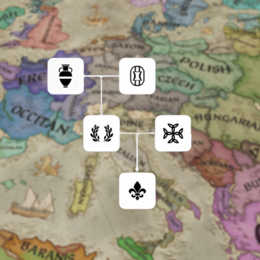
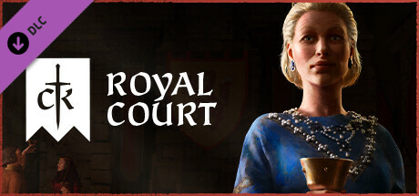
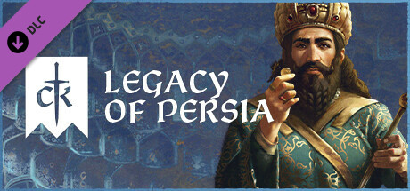
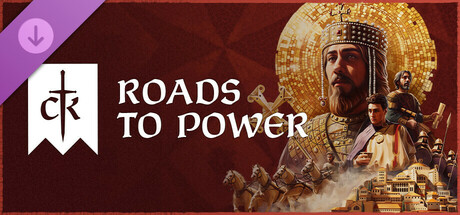
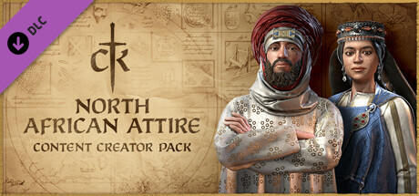
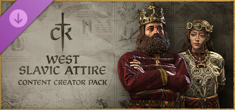

# Historical Mod
The mod aims to make the game more accurate for players that find it lacking the cultures, decision-making and 3D models.

## Game Required:

## DLC(s) Required:

  
  
  
  
  
  
  

