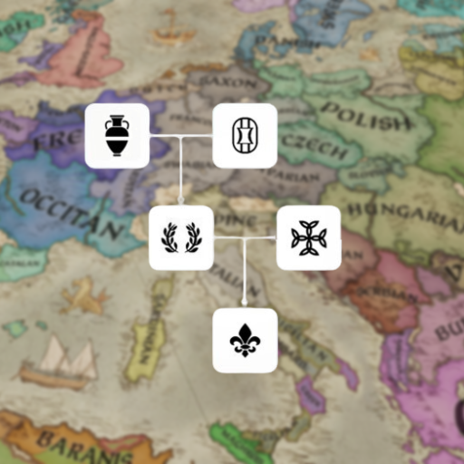

# Historical Mod
This mod enhances historical accuracy for players who feel the base game lacks cultural representation, immersive decision-making, and detailed 3D models.

## Game Required:

## DLC(s) Required:

  <a href="https://store.steampowered.com/app/1303182/Crusader_Kings_III_Royal_Court/">
  <a href="https://store.steampowered.com/app/2311920/Crusader_Kings_III_Tours__Tournaments/">
  
  
  
  
  
  
  
  
  

## Mod(s) Required:
This mod builds upon other mods, enhancing their level of expression and attention to detail. As such, the following mods are required and must be loaded in the specified order.
All required mods can be found on the game’s Steam Workshop page.

- <a href="https://steamcommunity.com/sharedfiles/filedetails/?id=2452585382">Medieval Arts</a>
- <a href="https://steamcommunity.com/sharedfiles/filedetails/?id=2220098919">Community Flavor Pack</a>
- <a href="https://steamcommunity.com/sharedfiles/filedetails/?id=2943715129">More Buildings Reboot</a>
- <a href="https://steamcommunity.com/sharedfiles/filedetails/?id=3475614211">Architect of Holdings: Mini Holding Manager</a>
- <a href="https://steamcommunity.com/sharedfiles/filedetails/?id=2228417684">Ports on major rivers</a>
- <a href="https://steamcommunity.com/sharedfiles/filedetails/?id=2687816934">Wasteland Border Colour Remover</a>
- <a href="https://steamcommunity.com/sharedfiles/filedetails/?id=2891641440">Increased Zoom</a>
- <a href="https://github.com/Castro19exe/HistoricalMod">Historical Mod</a> # This mod
